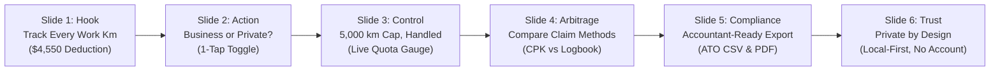

# KiloTax App Store Screenshots Blueprint & Specification
**Target Device Display:** Apple 6.9" Super Retina XDR (iPhone 16 Pro Max, iPhone 17 Pro Max, iPhone 18 Pro Max)  
**Document Version:** 1.0.0 (Production Release)  
**Target Market:** Australia (`en-AU`) — B2B Sole Traders, Tradies, Contractors, Freelancers  
**Regulatory Context:** Australian Taxation Office (ATO) ITAA 1997 Division 28-C (Cents per Kilometre: 91c/km for 2026–27)

---

## 1. Technical Delivery Specifications

| Parameter | Specification | Compliance Rationale |
|---|---|---|
| **Pixel Dimensions** | **1320 × 2868 px** | Exact Apple 6.9-inch portrait requirement. |
| **Color Space** | **sRGB (IEC61966-2.1)** | Standard Apple App Store rendering gamut. |
| **Bit Depth** | **24-bit RGB (8-bit per channel)** | Strict App Store rejection if 32-bit RGBA or alpha channel is detected. |
| **Alpha Channel** | **NONE (0% Transparency)** | App Store Connect will immediately error if an alpha channel exists. |
| **File Format** | **PNG-24 or High-Quality JPEG (Quality 98+)** | PNG without alpha is preferred for zero compression artifacting on crisp typography. |
| **File Size Limit** | **< 8.0 MB per image** | Below Apple's 10 MB maximum upload ceiling. |
| **Hardware Framing** | **ZERO hardware bezels** | Complies with Apple HIG. No Dynamic Island cutouts, no fake titanium/aluminum bezels, no device skins. |
| **Legal Disclaimers** | **Mandatory on all financial slides** | Mandatory under ACCC Consumer Law and Apple Guideline 2.3.1 (truth in advertising). |

---

## 2. Brand Identity & Design System: "High-Vis Aussie Tradie"

The visual theme combines the rugged, high-contrast utility of Australian worksite high-vis PPE with the refined, tactile precision of elite fintech tools (e.g. Linear, Stripe, Mercury).

### 2.1 Color Palette Tokens

```css
/* Background & Foundations */
--bg-carbon-black:     #0F172A; /* Deep slate-carbon canvas base */
--bg-carbon-surface:   #1E293B; /* High-contrast card surface */
--bg-carbon-elevated:  #0B132B; /* Deep cyber-navy anchor background */
--bg-border-subtle:    #334155; /* Slate 700 boundary lines (1.5px) */
--bg-border-highlight: #475569; /* Slate 600 elevated borders */

/* High-Vis Accents */
--accent-safety-amber: #F59E0B; /* Primary High-Vis Amber (Pantone 1235 C equivalent) */
--accent-amber-glow:   rgba(245, 158, 11, 0.18); /* Soft ambient aura */
--accent-amber-badge:  #D97706; /* High-contrast text on light amber / border */
--accent-amber-subtle: #FEF3C7; /* High-vis badge background */

/* Financial & Verification Accents */
--accent-mint-tax:     #10B981; /* Emerald / Mint 500: Cash savings & verified records */
--accent-mint-glow:    rgba(16, 185, 129, 0.20);
--accent-mint-subtle:  #ECFDF5; /* Verified badge background */

/* Typography & Contrast */
--text-white-pure:     #FFFFFF; /* 100% white for primary headers */
--text-off-white:      #F8FAFC; /* Slate 50 body titles */
--text-slate-muted:    #94A3B8; /* Slate 400 for secondary descriptions */
--text-slate-dark:     #64748B; /* Slate 500 for legal disclaimers */
```

### 2.2 Typography Scale & Hierarchy (at 1320 × 2868 px)

1. **Category Tag / Pill Badge:**
   - Font: SF Pro Display / Inter Bold (700)
   - Size: `32 px` (`font-size: 32px; letter-spacing: 0.12em; text-transform: uppercase;`)
   - Container: 18 px vertical padding, 36 px horizontal padding, border radius `9999px`.
2. **Main Billboard Headline:**
   - Font: SF Pro Display / Inter Black (800 / 900)
   - Size: `86 px` (`line-height: 104px; letter-spacing: -0.03em;`)
   - Maximum 2 lines. First line pure white, emphasis words in High-Vis Amber (`#F59E0B`).
3. **Sub-headline / Value Hook:**
   - Font: SF Pro Text / Inter Medium (500)
   - Size: `40 px` (`line-height: 54px; letter-spacing: -0.01em;`)
   - Color: Slate 300 (`#CBD5E1`) or Mint Green (`#10B981`).
4. **Card / Telemetry Data Typography:**
   - Large Metric Numbers: `112 px` SemiBold / Tabular Figures (`letter-spacing: -0.04em;`)
   - Metric Unit: `38 px` Bold (`#94A3B8`)
   - Card Titles & Section Headers: `36 px` SemiBold
   - Body & List Items: `32 px` Regular / Medium
5. **Micro-Legal Disclaimer:**
   - Font: SF Pro Text Regular (400)
   - Size: `22 px` (`line-height: 32px; letter-spacing: 0.01em;`)
   - Color: `#64748B` (WCAG AA compliant against `#0F172A`).

---

## 3. Global Canvas Grid Layout Architecture

```
0 px ───────────────────────────────────────────────────────────── (Canvas Top)
      ▲
      │ 150 px Safe Margin (Top Header Clearance)
      ▼
150 px ── [Eyebrow Badge / Pill] (Height: ~68 px)
240 px ── [Billboard Headline] (Height: ~190 px, 2 lines)
450 px ── [Sub-headline Hook] (Height: ~70 px)
      ▲
      │ 60 px Rhythm Gap
      ▼
580 px ── [HERO APPLICATION CARD CONTAINER]
          Width: 1128 px (Margins: Left 96 px, Right 96 px)
          Height: 2060 px (Y: 580 px to 2640 px)
          Border Radius: 64 px
          Background: Linear Gradient (#1E293B to #0B132B)
          Border: 2px Solid #334155
          Box Shadow: 0 40px 100px -20px rgba(0, 0, 0, 0.7)
      ▲
      │ 60 px Rhythm Gap
      ▼
2720 px ── [Legal Micro-Disclaimer Block]
           Height: 60 px
           Margins: Left 120 px, Right 120 px, Text Centered
2868 px ───────────────────────────────────────────────────────── (Canvas Bottom)
```

---

## 4. The 6-Slide Storyboard Blueprint



---

### Slide 1: "Track every work km" (The $4,550 Aha! Hook)

- **Conversion Objective:** Immediate commercial realization for ute drivers and sole traders. Establishes official ATO 91c/km rate and maximum $4,550 tax deduction.
- **Top Badge:** `ATO 2026-27 COMPLIANT · 91¢ PER KM` (Background: `#FEF3C7`, Text: `#B45309`)
- **Headline:**  
  `Track every work km.`  
  `<span style="color:#F59E0B">Claim up to $4,550.</span>`
- **Sub-headline:**  
  `Official 91c/km ATO Cents-per-Kilometre method for your ute or work car.`
- **Hero Card Elements (Y: 580 – 2640):**
  1. *Vehicle Profile Bar:*
     - Icon: Aussie Ute silhouette
     - Title: `2024 Toyota HiLux SR5 Double Cab`
     - Plate: `VIC · 1TR-8DE` · Status: `CPK Active`
  2. *Hero Financial Meter Card:*
     - Label: `ESTIMATED TAX DEDUCTION (2026–27)`
     - Big Number: `$4,550.00` in High-Vis Amber (`#F59E0B`)
     - Sub-bar: `5,000 km tracked @ 91c/km` (100% quota claimed)
     - Cash-in-pocket callout: `Approx. $1,456 back at 32% marginal tax bracket`
  3. *Recent Trip Ledger Cards (Sample trips):*
     - Card A: `Bunnings Warehouse ➔ Jobsite Bardon` · `34.2 km` · `+$31.12 deduction` · Badge: `Business`
     - Card B: `Reece Plumbing Supply ➔ Client Site Indooroopilly` · `18.5 km` · `+$16.84 deduction` · Badge: `Business`
     - Card C: `Site Inspection ➔ Kedron Workshop` · `42.0 km` · `+$38.22 deduction` · Badge: `Business`
  4. *Quick Start Banner:*
     - Pill: `Zero Setup · Start Tracking in 10 Seconds`
- **Legal Disclaimer (Y: 2730):**  
  `*Indicative deduction based on ATO 2026-27 rate of 91c/km up to 5,000 km cap per vehicle. Not financial or tax advice. Confirm claims with a registered tax agent. Source: ato.gov.au`

---

### Slide 2: "Business or private?" (1-Tap Fast Toggle)

- **Conversion Objective:** Overcome logging friction. Tradies hate complex forms. Shows how simple it is to swipe or tap once to tag a trip.
- **Top Badge:** `EFFORTLESS LOGGING · 10 SECONDS` (Background: `#EFF6FF`, Text: `#1E40AF`)
- **Headline:**  
  `Business or private?`  
  `<span style="color:#F59E0B">Sorted in one tap.</span>`
- **Sub-headline:**  
  `No manual forms, no paperwork on the dashboard.`
- **Hero Card Elements (Y: 580 – 2640):**
  1. *Active Trip Card in Review:*
     - Header: `New Trip Recorded · 28.4 km`
     - Time: `Today, 2:15 PM – 2:48 PM`
     - Route: `14 Trade Coast Way, Eagle Farm ➔ 88 Queen St, Brisbane`
  2. *Interactive Dual-Toggle Pill Buttons:*
     - Left Button (Highlighted): `💼 Work Trip (Claimable)` with Safety Amber border and solid mint checkmark
     - Right Button: `🏠 Private Trip (Personal)` in slate muted tone
  3. *Quick Purpose Tag Chips:*
     - `Materials Pickup`, `Client Meeting`, `Tool Transport`, `Site Visit`, `Between Jobsites`
  4. *Instant Calculated Tax Shield:*
     - `+$25.84 added to 2026-27 tax claim`
     - Live counter update animation cue
- **Legal Disclaimer (Y: 2730):**  
  `Under ATO rules, travel between home and normal workplace is generally private. Travel between jobsites or transporting bulky tools is eligible. Verify your travel circumstances.`

---

### Slide 3: "5,000 km cap, handled" (Live Quota Progress)

- **Conversion Objective:** Eliminate fear of exceeding the ATO 5,000 km limit blindly. Demonstrates the live cap tracker and rollover intelligence.
- **Top Badge:** `ATO CAP PROTECTION` (Background: `#ECFDF5`, Text: `#059669`)
- **Headline:**  
  `5,000 km cap, handled.`  
  `<span style="color:#10B981">Never leave money behind.</span>`
- **Sub-headline:**  
  `Real-time quota monitoring prevents unexpected tax office surprises.`
- **Hero Card Elements (Y: 580 – 2640):**
  1. *Circular or Thick Radial Quota Gauge:*
     - Value: `4,180 / 5,000 km` (83.6% filled)
     - Remaining: `820 km remaining this financial year`
     - High-Vis amber to emerald progress fill
  2. *Cap Telemetry Summary:*
     - Deductions Claimed to Date: `$3,803.80`
     - Remaining Quota Value: `$746.20`
     - Estimated Cap Reached Date: `18 May 2027`
  3. *Smart Multi-Vehicle Carousel:*
     - Vehicle 1 (Ute): `4,180 km` (83% of cap)
     - Vehicle 2 (Van / Runabout): `1,420 km` (28% of second vehicle 5,000 km cap)
     - Callout: `*ATO permits 5,000 km per car owned/leased`
- **Legal Disclaimer (Y: 2730):**  
  `The ATO Cents per Kilometre method allows up to 5,000 business km per vehicle, per income year. Multiple vehicles have separate 5,000 km caps if owned or leased by eligible taxpayers.`

---

### Slide 4: "Compare claim methods" (Arbitrage: CPK vs Logbook)

- **Conversion Objective:** High-value upgrade trigger. Educates high-mileage tradies that switching to a 12-week logbook can yield thousands more in depreciation and fuel deductions.
- **Top Badge:** `METHOD ARBITRAGE · MAXIMISE REFUND` (Background: `#FEF3C7`, Text: `#D97706`)
- **Headline:**  
  `Compare claim methods.`  
  `<span style="color:#F59E0B">See what pays you more.</span>`
- **Sub-headline:**  
  `Side-by-side comparison of Cents-per-Km vs Actual Logbook expenses.`
- **Hero Card Elements (Y: 580 – 2640):**
  1. *Comparison Matrix Grid:*
     - Column Left: `Cents per Km (CPK)`
       - Capped at: `5,000 km max`
       - Total Claim: `$4,550.00`
       - Effort: `Zero receipts needed`
     - Column Right (Highlighted Winner): `Logbook Method`
       - Business Use: `78.4%` (based on 18,400 total km)
       - Fuel + Rego + Insurance + Servicing: `$8,420`
       - Depreciation (Instant Asset Write-Off): `$6,800`
       - Total Eligible Claim: `<span style="color:#10B981">$11,937.28</span>`
  2. *Money Left on the Table Callout Box:*
     - Amber Banner: `+ $7,387.28 Higher Claim Potential`
     - Explanatory subtext: `You drive over 12,000 work km/year. Switching to an ATO 12-week logbook could significantly increase your tax deduction.`
  3. *1-Tap Action:*
     - Button: `Start 12-Week Logbook Mode`
- **Legal Disclaimer (Y: 2730):**  
  `*Logbook comparison is illustrative. Actual claims depend on real vehicle operating expenses, genuine business percentage, and valid tax receipts. Consult your registered accountant.`

---

### Slide 5: "Accountant-ready export" (1-Tap Tax Pack)

- **Conversion Objective:** Eliminate EOFY stress. Shows how clean ATO-formatted CSV and PDF records are shared directly to the user's accountant or tax agent in seconds.
- **Top Badge:** `TAX PACK GENERATOR · EOFY READY` (Background: `#EFF6FF`, Text: `#1E40AF`)
- **Headline:**  
  `Accountant-ready export.`  
  `<span style="color:#10B981">Done in 5 seconds.</span>`
- **Sub-headline:**  
  `Full ATO ITAA 1997 Division 28 audit log in CSV & formatted PDF.`
- **Hero Card Elements (Y: 580 – 2640):**
  1. *Export Configuration Modal:*
     - Period Selector: `2026–27 Financial Year (1 Jul 2026 – 30 Jun 2027)`
     - File Format Checkboxes: `✓ ATO Division 28 CSV` & `✓ Summary PDF Tax Pack`
  2. *Live Tax Pack Document Preview:*
     - Header: `KILOTAX AUDIT REPORT · VEHICLE TAX SUMMARY`
     - Summary Box: `Total Work Trips: 142 · Total Distance: 4,890 km · Claim: $4,449.90`
     - Clean Table Preview: Columns for Date, Odometer Start/End, Distance, Purpose, Rate, Claim.
  3. *Direct Action CTA:*
     - Big Tactile Button: `Share Tax Pack with Accountant`
     - Secondary Options: `AirDrop to Mac`, `Save to Files`, `Email to Bookkeeper`
- **Legal Disclaimer (Y: 2730):**  
  `Records generated adhere to ATO record-keeping requirements under Section 900-115 of ITAA 1997. KiloTax is not affiliated with the Australian Taxation Office.`

---

### Slide 6: "Private by design" (Local-First, No Account)

- **Conversion Objective:** Address privacy-conscious tradies who hate telematics spyware, unwanted subscription accounts, and big tech tracking their work routes.
- **Top Badge:** `LOCAL-FIRST ARCHITECTURE · ZERO ADS` (Background: `#ECFDF5`, Text: `#059669`)
- **Headline:**  
  `Private by design.`  
  `<span style="color:#F59E0B">Your data stays on your phone.</span>`
- **Sub-headline:**  
  `No mandatory account. No cloud tracking. No data brokers.`
- **Hero Card Elements (Y: 580 – 2640):**
  1. *Shield Security Hero Graphic:*
     - High-Vis Amber & Mint Vault Shield with device lock icon
     - Badge: `100% On-Device SQLite & Encrypted Vault`
  2. *Feature Checklist Grid:*
     - `✓ No Sign-up Required` — Start immediately as a Guest
     - `✓ Zero Telematics Spyware` — No live background tracking of private trips
     - `✓ Your Routes Stay Local` — Stored on your iPhone, not corporate servers
     - `✓ 1-Tap Complete Data Wipe` — Reset or export anytime (Apple 5.1.1 compliant)
     - `✓ Optional iCloud Sync` — Back up your trips safely without creating an account
  3. *Aussie Built Stamp:*
     - `Designed in Australia for Australian Work Conditions`
- **Legal Disclaimer (Y: 2730):**  
  `All trip records and financial calculations are processed locally on device. Optional cloud backup utilizes Apple iCloud end-to-end security.`

---

## 5. Pixel-Precise Element Coordinates & Spec Table

| Element | Slide 1 (Hero) | Slide 2 (Toggle) | Slide 3 (Cap) | Slide 4 (Compare) | Slide 5 (Export) | Slide 6 (Privacy) |
|---|---|---|---|---|---|---|
| **Top Eyebrow Badge (X, Y)** | (96, 160) | (96, 160) | (96, 160) | (96, 160) | (96, 160) | (96, 160) |
| **Headline Line 1 (X, Y)** | (96, 260) | (96, 260) | (96, 260) | (96, 260) | (96, 260) | (96, 260) |
| **Headline Line 2 (X, Y)** | (96, 360) | (96, 360) | (96, 360) | (96, 360) | (96, 360) | (96, 360) |
| **Subhead Hook (X, Y)** | (96, 470) | (96, 470) | (96, 470) | (96, 470) | (96, 470) | (96, 470) |
| **Main Card Outer Box (X, Y, W, H)** | (96, 580, 1128, 2060) | (96, 580, 1128, 2060) | (96, 580, 1128, 2060) | (96, 580, 1128, 2060) | (96, 580, 1128, 2060) | (96, 580, 1128, 2060) |
| **Card Border Radius** | `64 px` | `64 px` | `64 px` | `64 px` | `64 px` | `64 px` |
| **Card Background** | Gradient: `#1E293B` to `#0B132B` | Gradient: `#1E293B` to `#0B132B` | Gradient: `#1E293B` to `#0B132B` | Gradient: `#1E293B` to `#0B132B` | Gradient: `#1E293B` to `#0B132B` | Gradient: `#1E293B` to `#0B132B` |
| **Card Border** | `2px solid #334155` | `2px solid #334155` | `2px solid #334155` | `2px solid #334155` | `2px solid #334155` | `2px solid #334155` |
| **Key In-Card Metric / Component** | Big `$4,550.00` & Trip List | Dual Work/Private Pills | Circular 83.6% Cap Gauge | CPK vs Logbook side-by-side | PDF/CSV Export Sheet | Local Vault Shield & Checklist |
| **Legal Disclaimer (X, Y, W)** | (120, 2730, 1080) | (120, 2730, 1080) | (120, 2730, 1080) | (120, 2730, 1080) | (120, 2730, 1080) | (120, 2730, 1080) |

---

## 6. Apple App Store Guidelines Strict Compliance Checklist

1. **Guideline 2.3.1 (Performance - Accurate Metadata):**
   - All screenshots accurately represent the actual functionality of the KiloTax iOS app (Division 28-C 91c/km calculations, trip classification, 5,000 km cap tracking, CSV/PDF export, guest mode).
   - No mockups of non-existent features (e.g. no claims of automatic government tax filing or instant cash deposits).
2. **Guideline 4.1 (Design - Copycats / Hardware Misrepresentation):**
   - **No fake Apple device frames:** Strictly NO hardware chassis, antenna bands, camera bumps, speaker holes, or physical buttons drawn around the images.
   - **No fake Dynamic Island or notch cutouts:** UI cards utilize clean iOS native container architecture with soft-cornered viewports.
   - **No Apple trademarks:** No Apple logos or "Apple Official" badges.
3. **Guideline 5.1.1 (Privacy):**
   - Accurately conveys that data is stored locally and account creation is not mandatory to use core deduction tracking.
4. **Australian Consumer Law (ACCC) & ATO Brand Regulations:**
   - Clearly disclaims: *"Not financial advice. Rates: ato.gov.au. Not affiliated with or endorsed by the Australian Taxation Office."*
   - Never uses protected terms like "ATO Approved" or "Official ATO App". Uses "ATO Compliant Rate (91c/km)" referring to the statutory legislative rate.
5. **Technical File Integrity:**
   - Dimension: Exactly 1320 × 2868 px.
   - Color Profile: sRGB, 24-bit RGB.
   - Alpha channel removed completely (no transparent pixels).

---

## 7. Templates & Production Assets

Standalone production SVG templates and an interactive HTML inspection studio are provided in:
- `docs/app_store/templates/index.html` (Interactive multi-slide canvas inspector)
- `docs/app_store/templates/slide_1_hero_km.svg`
- `docs/app_store/templates/slide_2_toggle.svg`
- `docs/app_store/templates/slide_3_cap_handled.svg`
- `docs/app_store/templates/slide_4_compare_methods.svg`
- `docs/app_store/templates/slide_5_export_taxpack.svg`
- `docs/app_store/templates/slide_6_private_local.svg`
- `docs/app_store/render_screenshots.py` (Script to validate image specs and render pixel-perfect PNG assets)
